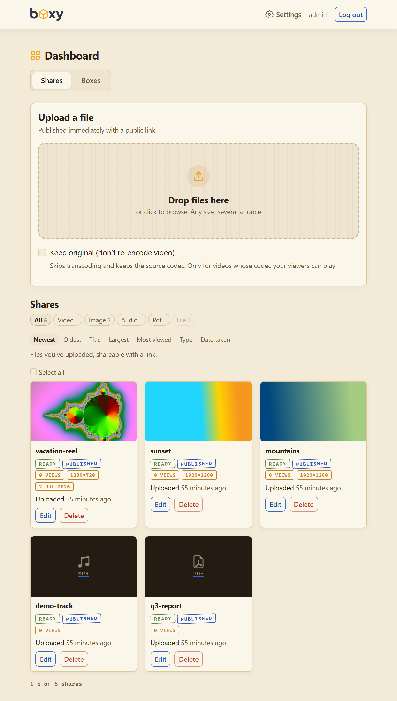
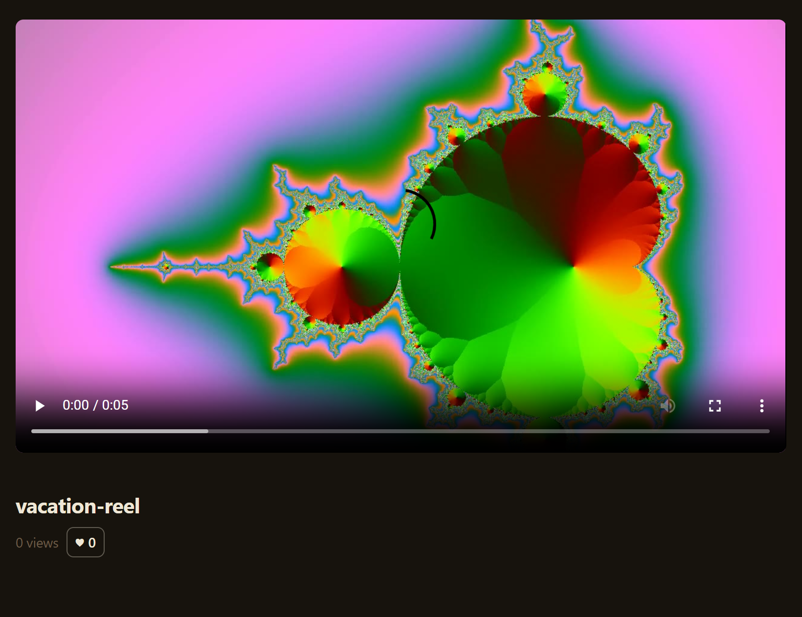
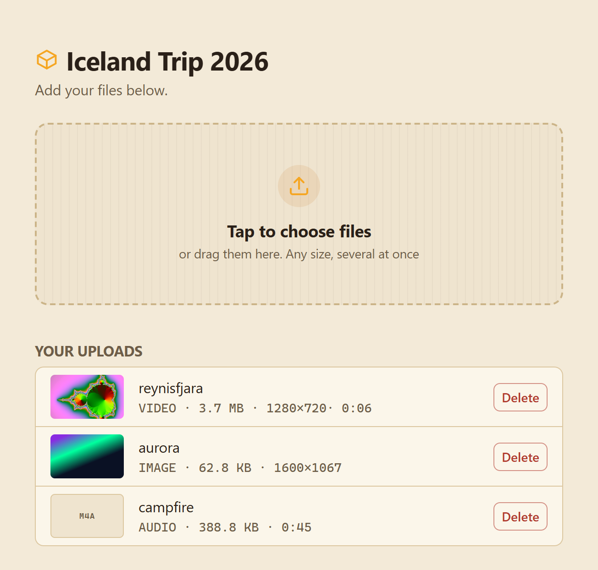
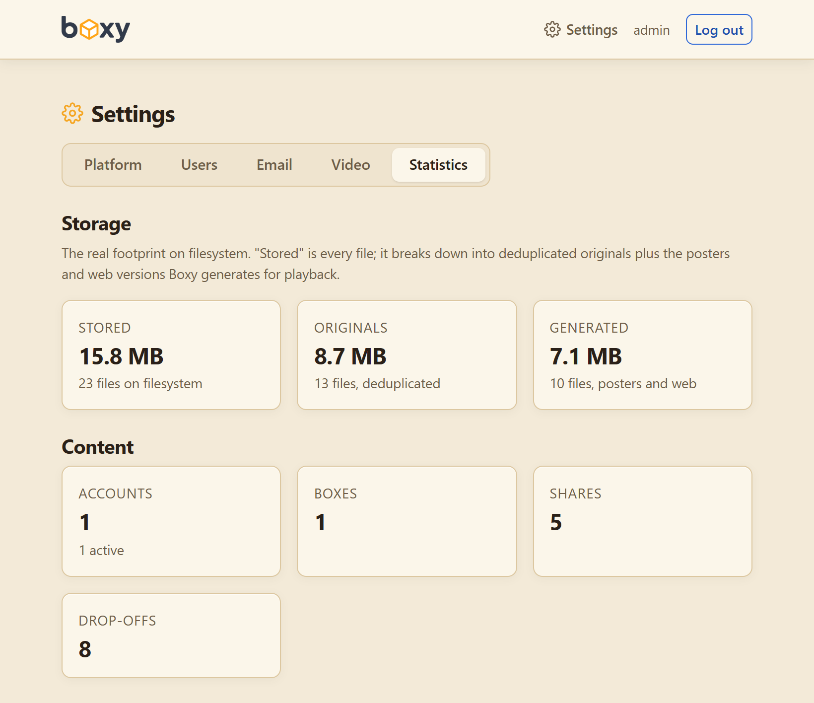

<p align="center">
  
</p>

<p align="center">
  
  
  
</p>

# Boxy

Boxy is a friendly little file service you host yourself. Send files to people, and just as easily get files from them, all at full quality.

Ever asked friends for the good photos from a trip and got sad, compressed thumbnails out of the group chat instead? Hand them a Boxy link and the real originals land straight with you. Or just need to fling a file at someone? Drop it in, grab the link, done.

No "sign up to download", no mystery expiry, no third party rifling through your stuff. It's **self-hosted and open source**: your files, your server, your rules.

- **Share** a file: upload it, get a link, send it to anyone.
- **Receive** files: hand out a box link and people upload straight to you, no account needed.

A little bit similar to WeTransfer but our mascot is a cat. 🐱

## Screenshots

<p align="center">
  <a href="docs/screenshots/dashboard.png"></a>
  <a href="docs/screenshots/share-view.png"></a>
  <a href="docs/screenshots/upload-page.png"></a>
  <a href="docs/screenshots/stats.png"></a>
</p>
<p align="center"><sub>Dashboard · watch or download a share · the drop-off page · statistics. Click any to enlarge.</sub></p>

## Quick Start

```yaml
services:
  boxy:
    build:
      context: .
      dockerfile: Boxy.Web/Dockerfile
    image: boxy:latest
    container_name: boxy
    restart: unless-stopped
    ports:
      - "3895:3895"
    environment:
      Admin__Email: "admin@example.com"
      Admin__Password: "change-me"
      PUID: "1000"
      PGID: "1000"
    volumes:
      - ./data:/data
```

Clone the repo, set a strong `Admin__Password`, then `docker compose up -d --build` and sign in at `http://localhost:3895`.

## What's in the box

- **Big files, no sweat.** Multi-gigabyte videos upload in chunks, so a flaky connection picks up where it left off instead of starting over.
- **Full quality, always.** Your originals are kept exactly as sent. Nothing gets quietly re-compressed behind your back.
- **No account for the other side.** People can send files to you, or grab files from you, without signing up for anything.
- **See who sent what.** Files that land in a box are tagged by uploader and show their size, dimensions and date, so a shared box stays readable instead of a heap of identical DSC_0001.jpg.
- **Plays anywhere.** Awkward video formats get converted once so they just play in the browser. No plugins, no "please download VLC".
- **Yours to keep.** Self-hosted and open source. Files live on your server for as long as you like, and go through nobody else.

And the handy extras: password-protected and expiring links, per-user accounts with storage limits, email or webhook alerts when files land, and S3 / Azure storage for when local disk runs out.

## Light and fast

No database server, no Redis, no message queue, no cloud account. Boxy is one process and one SQLite file, with FFmpeg bundled in.

The whole front end is Bootstrap plus about 38 KB of hand-written JavaScript. No React, no SPA, no build step, so pages just load and there's very little to go wrong. Video is served as a plain progressive MP4 and played by the browser itself, so seeking works with no media server or HLS in the middle. Uploads are chunked and resumable, downloads are range-served, and identical files are only ever stored once.

Perfectly happy on a small, cheap VPS.

## Installation

Boxy ships as a single container with FFmpeg bundled. It needs one volume at `/data` and an admin password.

### Docker Run

```bash
docker run -d \
  --name boxy \
  -p 3895:3895 \
  -e Admin__Password="change-me" \
  -e PUID=1000 -e PGID=1000 \
  -v "$(pwd)/data:/data" \
  boxy:latest
```

### Build from source

One multi-stage build restores, publishes, and packages the image from a clean checkout:

```bash
docker build -t boxy:latest -f Boxy.Web/Dockerfile .
```

For local development (needs the .NET 10 SDK and FFmpeg on your PATH):

```bash
Admin__Password=dev StoragePath=./data/storage \
ConnectionStrings__DefaultConnection="Data Source=./data/boxy.db" \
dotnet run --project Boxy.Web
```

### Running the tests

```bash
dotnet test
```

## Configuration

Settings come from environment variables (or `appsettings.json`). Defaults are sensible, so you mainly need an admin password. Nested keys use a double underscore, like `Admin__Password`. Put a reverse proxy in front of port `3895` and set `PublicBaseUrl` so links and previews are absolute.

| Variable | Description | Default |
|---|---|---|
| `Admin__Password` | Password for the first-run admin account, created on first launch. Login is disabled while empty. | *(empty)* |
| `Admin__Email` | Email the first-run admin signs in with (accounts log in by username or email). | `admin` |
| `Admin__Username` | Optional handle the first-run admin can sign in with, alongside the email. | *(empty)* |
| `PublicBaseUrl` | Base URL for share links and previews. Empty uses the request host. | *(empty)* |
| `ConnectionStrings__DefaultConnection` | SQLite connection string. | `Data Source=/data/boxy.db` |
| `StoragePath` | Where uploaded files are stored (and always the local scratch area, whatever the backend). | `/data/storage` |
| `Storage__Provider` | Where finished content lives: `filesystem`, `s3`, or `azure`. | `filesystem` |
| `Email__Provider` | Drop-off email notifications: `none` or `smtp`. | `none` |
| `PUID` / `PGID` | Host user/group to run as, for volume ownership. | `888` |

On first launch Boxy creates the admin account from `Admin__Password` and adopts any existing content under it; after that, accounts are managed in the app under Settings. If an upgrade ever leaves the instance without an admin, restart with `Admin__Password` set and the configured account is restored to admin. Registration is off by default, so it stays a single-admin instance until you turn it on. Accounts sign in with a username or an email.

The `/data` volume holds the SQLite database and uploaded files, so back it up.

### Storage backends

By default content is stored on the local disk under `StoragePath`. To keep it in object storage instead, set `Storage__Provider` and the matching keys. Uploads, chunk staging, and ffmpeg still use local scratch (under `StoragePath`); only finished content is sent to the backend, and byte-range playback is streamed back through the app.

- **S3 (or any S3-compatible service - MinIO, R2, Backblaze):** `Storage__Provider=s3`, `Storage__S3__Bucket`, `Storage__S3__AccessKey`, `Storage__S3__SecretKey`, `Storage__S3__Region`. For a non-AWS endpoint also set `Storage__S3__ServiceUrl` (and keep `Storage__S3__ForcePathStyle=true`).
- **Azure Blob Storage:** `Storage__Provider=azure`, `Storage__Azure__ConnectionString`, `Storage__Azure__Container`.

The bucket/container is created on startup if it doesn't exist. `docker-compose.dev.yml` brings up MinIO, Azurite, and MailCatcher for trying these locally.

### Email notifications

Box owners can opt in (per box) to an email when files are dropped in, and owners are emailed before expired content is deleted. Configure SMTP either in the app under **Settings → Email** (host, port, security, from, username, password, with a "send test email" button) or via environment: `Email__Provider=smtp` with `Email__Smtp__Host`, `Email__Smtp__Port`, `Email__Smtp__Security` (`none` / `starttls` / `ssl` / `auto`), optional `Email__Smtp__User` and `Email__Smtp__Password`, and `Email__From`. In-app settings take precedence; until you save any, the environment values are used. The SMTP password saved in-app is encrypted at rest (Data Protection keys live in the database, not on disk). A webhook per box is also available and needs no configuration.

### Video quality

Videos that browsers can't play as-is are re-encoded once. Configure that in the app under **Settings → Video**: quality (CRF), max resolution, encoding speed, and a bitrate ceiling. These are edited in-app only; sensible built-in defaults apply until you save your own. Changes apply to videos uploaded from then on — your originals are never touched and anything already processed keeps the version it has.

The FFmpeg binary paths (`Ffmpeg__FfmpegPath`, `Ffmpeg__FfprobePath`) stay environment-only by design and are not editable in the app.

Storage, by contrast, is configured only via environment (see above): switching backend needs a migration of existing content, so it isn't a runtime toggle.

## Built With

- [.NET 10](https://dotnet.microsoft.com/) and ASP.NET Core MVC
- [FFmpeg](https://ffmpeg.org/) for probing, posters, and transcoding
- [SQLite](https://www.sqlite.org/) via [EF Core](https://learn.microsoft.com/ef/core/)
- [Bootstrap](https://getbootstrap.com/) for the interface

## License

Boxy is free software, Copyright © 2026 KirovAir, licensed under the [GNU General Public License v3.0](LICENSE.md).

Third-party components are listed in [THIRD-PARTY-NOTICES.md](THIRD-PARTY-NOTICES.md).
